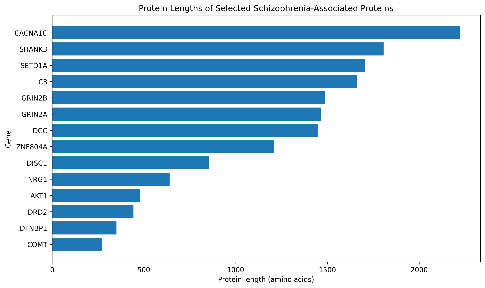
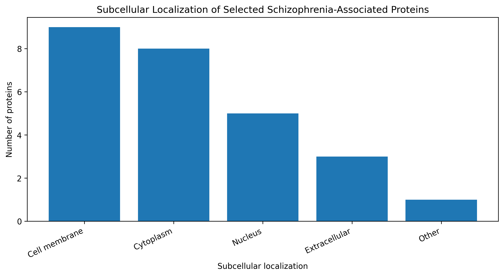
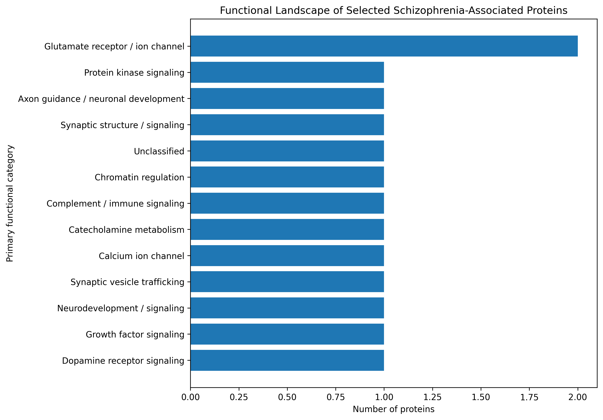

# Functional Landscape of Schizophrenia-Associated Proteins

## Overview

This project explores the functional and molecular characteristics of a selected set of proteins associated with schizophrenia using data retrieved programmatically from UniProt.

The analysis examines protein length, subcellular localization, and broad primary functional categories to visualize the biological diversity represented within the selected protein set.

## Research Question

What functional and molecular characteristics are shared among proteins associated with schizophrenia?

## Dataset

The initial analysis included 15 selected schizophrenia-associated genes.

UniProt reviewed human protein records were retrieved using the UniProt REST API.

14 protein records were successfully retrieved.

MIR137 was excluded because it did not map to a reviewed human protein record in the protein-level UniProt query.

## Analysis

The project includes:

- Retrieval of reviewed human protein records from UniProt
- Protein length analysis
- Approximate molecular-weight estimation from protein length
- Subcellular localization classification
- Manual primary functional categorization based on UniProt function descriptions
- Visualization of functional and molecular characteristics

## Key Observations

- The analyzed proteins show substantial variation in protein length.
- Protein lengths range from 271 amino acids to 2,221 amino acids.
- The selected proteins span diverse biological roles, including neurotransmitter signaling, ion-channel activity, synaptic biology, chromatin regulation, neuronal development, kinase signaling, metabolism, and immune signaling.
- Glutamate receptor / ion channel function is represented by two proteins in the selected set.
- ZNF804A was retained in the dataset but left unclassified because no function annotation was available in the retrieved UniProt record.

## Figures

### Protein Lengths

### Subcellular Localization

### Functional Landscape

## Limitations

This is an exploratory analysis of a small, manually selected set of schizophrenia-associated proteins. The results should not be interpreted as demonstrating statistical enrichment or causality.

The functional categories are broad, manually assigned categories based on UniProt function descriptions rather than results from formal pathway-enrichment analysis.

Subcellular localization categories may overlap because a protein can occur in multiple cellular compartments.

MIR137 was excluded from the protein-level analysis because it did not correspond to a reviewed human protein record.

## Tools and Technologies

- Python
- Google Colab
- pandas
- matplotlib
- UniProt REST API

## Data Source

UniProt Knowledgebase

https://www.uniprot.org/

## Reproducibility

The analysis was performed programmatically in Python using the UniProt REST API. The processed dataset and generated figures are included in this repository.

## How to Reproduce

1. Open `Schizophrenia_Protein_Analysis.ipynb` in Google Colab or Jupyter Notebook.
2. Run the cells in order to retrieve the protein data from UniProt and reproduce the analysis.
3. The processed dataset is available in `data/`.
4. Generated figures are available in `figures/`.

## Disclaimer

Association with schizophrenia does not imply that a protein directly causes schizophrenia. Schizophrenia is a complex, polygenic disorder involving many biological pathways and genetic factors.
